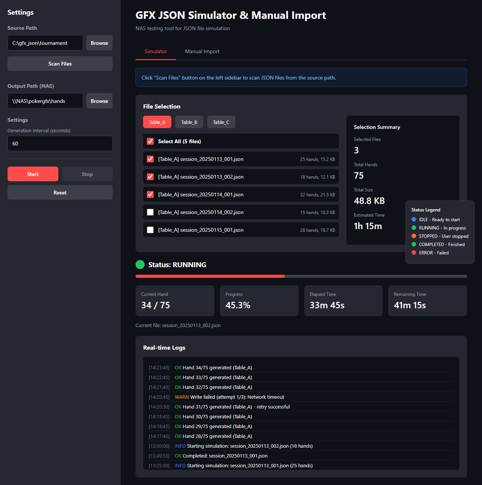
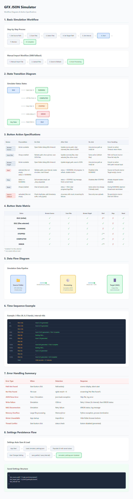

# GFX JSON Simulator PRD

**번호**: PRD-0009
**작성일**: 2026-01-13
**우선순위**: High
**상태**: In Progress (89%)

---

## 1. 개요

### 문제 정의
PokerGFX 시스템과 NAS 연동 테스트 시, 실제 게임 없이는 JSON 파일 생성이 불가능하여 개발/테스트 환경에서 파일 감시 및 처리 로직을 검증할 수 없음.

### 제안 솔루션
기존 GFX JSON 파일을 입력받아, 실제 게임 진행처럼 핸드를 하나씩 추가하며 누적 JSON 파일을 생성하는 시뮬레이터 제공. Streamlit GUI로 실시간 모니터링 및 제어 가능.

### 예상 효과
- 실제 게임 없이 NAS 연동 테스트 가능
- 파일 감시 로직 검증 시간 단축
- SMB 장애 시나리오 테스트 가능

---

## 2. 목표

### 비즈니스 목표
1. 개발/테스트 환경에서 PokerGFX 파일 생성 시뮬레이션
2. NAS 연동 안정성 사전 검증
3. 장애 대응 시나리오 테스트

### 사용자 목표
1. 실제 게임 진행과 유사한 JSON 파일 생성
2. 실시간 진행 상황 모니터링
3. 간편한 파일 선택 및 설정

---

## 3. 대상 사용자

**주요 사용자 유형**: 내부 개발/운영팀
**기술 수준**: 중급 (기본 개념 이해)
**예상 사용자 수**: 3-5명

---

## 4. 사용자 스토리

### 스토리 1: 기본 시뮬레이션
```
As a 개발자,
I want to 기존 GFX JSON 파일을 선택하여 시뮬레이션 실행
So that NAS 파일 감시 로직을 테스트할 수 있다

Acceptance Criteria:
- Given 소스 폴더에 GFX JSON 파일이 존재
- When 파일을 선택하고 시작 버튼 클릭
- Then 지정 간격으로 누적 JSON이 타겟 폴더에 생성됨
```

### 스토리 2: 진행 상황 모니터링
```
As a 운영자,
I want to 시뮬레이션 진행률과 로그를 실시간으로 확인
So that 문제 발생 시 즉시 대응할 수 있다

Acceptance Criteria:
- Given 시뮬레이션이 실행 중
- When GUI를 확인
- Then 현재 핸드, 진행률, 예상 시간, 로그가 표시됨
```

### 스토리 3: 수동 파일 Import
```
As a 운영자,
I want to SMB 장애 시 수동으로 파일을 업로드
So that 시스템 연속성을 유지할 수 있다

Acceptance Criteria:
- Given SMB 연결 실패
- When 수동 Import 탭에서 파일 업로드
- Then Fallback 폴더에 파일 저장 및 처리됨
```

### 스토리 4: 설정 저장
```
As a 사용자,
I want to 마지막 설정(경로, 간격)이 자동 저장
So that 재시작 시 다시 설정할 필요가 없다

Acceptance Criteria:
- Given 경로와 간격 설정 후 시뮬레이션 실행
- When 애플리케이션 재시작
- Then 마지막 설정이 자동 로드됨
```

---

## 5. 기능 요구사항

### 5.1 필수 기능 (Must Have)

1. **핸드 분리 (HandSplitter)**
   - 설명: GFX JSON에서 Hands 배열 추출 및 HandNum 기준 정렬
   - 수락 기준:
     - [x] `split_hands()` - 핸드 목록 추출
     - [x] `build_cumulative()` - 누적 JSON 생성
     - [x] `extract_metadata()` - 메타데이터 추출

2. **시뮬레이터 코어 (GFXJsonSimulator)**
   - 설명: 비동기 시뮬레이션 실행, 상태 관리
   - 수락 기준:
     - [x] `run()` - 비동기 시뮬레이션 실행
     - [x] `stop()` - 사용자 중단 처리
     - [x] `simulate_file()` - 단일 파일 처리
     - [x] 재시도 로직 (3회, 지수 백오프)

3. **Streamlit GUI**
   - 설명: 웹 기반 사용자 인터페이스
   - 수락 기준:
     - [x] 소스/타겟 경로 설정
     - [x] 파일 스캔 및 선택
     - [x] 진행률 바 및 상태 표시
     - [x] 실시간 로그 뷰어
     - [x] 시작/정지/초기화 버튼

4. **설정 영속화**
   - 설명: 사용자 설정을 JSON 파일로 저장
   - 수락 기준:
     - [x] 소스/타겟 경로 저장
     - [x] 생성 간격 저장
     - [x] 앱 재시작 시 자동 로드

### 5.2 선택 기능 (Nice to Have)

1. [x] 수동 Import 탭 (SMB Fallback)
2. [x] CLI 모드 (`--no-gui` 옵션)
3. [ ] 멀티 테이블 병렬 시뮬레이션
4. [ ] 시뮬레이션 일시 정지/재개

---

## 6. 범위 제외 (Out of Scope)

- 실제 PokerGFX 연동 (시뮬레이션 전용)
- 카드 인식/RFID 처리
- Supabase 직접 연동 (PRD-0011에서 처리)
- 핸드 등급 분류 (별도 모듈)

---

## 7. 데이터 요구사항

### 입력 데이터
- GFX JSON 파일 (Hands 배열 포함)
- 메타데이터: CreatedDateTimeUTC, EventTitle

### 출력 데이터
- 누적 JSON 파일 (핸드 1개씩 추가)
- 로그 메시지 (타임스탬프, 레벨, 메시지)

### JSON 구조
```json
{
  "CreatedDateTimeUTC": "2026-01-13T10:00:00Z",
  "EventTitle": "WSOP Main Event",
  "Hands": [
    {"HandNum": 1, "Cards": ["Ah", "Kh"]},
    {"HandNum": 2, "Cards": ["Qd", "Jd"]}
  ]
}
```

### 설정 저장 형식
```json
{
  "last_source_path": "C:/gfx_json",
  "last_target_path": "\\\\NAS/pokergfx/hands",
  "last_interval": 60
}
```

---

## 8. UI/UX 고려사항

### 화면 구성

1. **사이드바 (설정)**
   - 소스 경로 입력 + 폴더 선택 버튼
   - 타겟 경로 입력 + 폴더 선택 버튼
   - 파일 스캔 버튼
   - 생성 간격 (초) 입력
   - 시작/정지/초기화 버튼

2. **메인 영역 (시뮬레이터 탭)**
   - 파일 선택 (테이블별 그룹화)
   - 선택 요약 (파일 수, 핸드 수, 예상 시간)
   - 진행률 바
   - 메트릭 카드 (현재 핸드, 진행률, 경과/남은 시간)
   - 실시간 로그 (최근 50개)

3. **메인 영역 (수동 Import 탭)**
   - 파일 업로드 드래그앤드롭
   - Fallback 폴더 내 파일 목록

### 주요 인터랙션
1. 폴더 선택 버튼 → tkinter 다이얼로그
2. 파일 스캔 → 테이블별 체크박스 목록
3. 시작 → 진행률 자동 갱신 (1초)

---

## 9. 기술 고려사항

### 기술 스택
- **언어**: Python 3.11+
- **GUI**: Streamlit 1.30+
- **비동기**: asyncio
- **파일 다이얼로그**: tkinter (선택)

### 외부 의존성
```
streamlit>=1.30.0
pydantic-settings>=2.0.0
watchdog>=3.0.0  # (fallback용)
```

### 성능 요구사항
- 파일 쓰기 실패 시 3회 재시도 (5초 간격)
- 로그 최대 100개 유지 (메모리 제한)
- GUI 갱신 주기 1초

### 보안 고려사항
- [x] 경로 검증 (존재 확인)
- [x] JSON 파싱 에러 핸들링
- [ ] 민감 정보 로깅 방지

---

## 10. 성공 지표

### 정량적 지표
- 파일 쓰기 성공률: 99% 이상
- 재시도 후 복구율: 95% 이상
- GUI 응답 시간: < 1초

### 정성적 지표
- NAS 연동 테스트 용이성 향상
- 장애 시나리오 재현 가능

---

## 11. 마일스톤

| Phase | 설명 | 상태 |
|-------|------|------|
| Phase 1 | 핵심 시뮬레이터 (HandSplitter, CLI) | 완료 |
| Phase 2 | Streamlit GUI | 완료 |
| Phase 3 | 설정 및 에러 처리 | 완료 |
| Phase 4 | 테스트 및 문서화 | 진행 중 (38%) |

---

## 12. 파일 구조

```
src/simulator/
├── __init__.py
├── config.py              # SimulatorSettings, 경로 저장
├── hand_splitter.py       # HandSplitter 클래스
├── gfx_json_simulator.py  # GFXJsonSimulator, CLI
└── gui/
    ├── __init__.py
    ├── app.py             # Streamlit 메인
    └── file_browser.py    # 파일 브라우저 유틸리티
```

---

## 13. 실행 방법

### GUI 모드 (권장)
```powershell
streamlit run src/simulator/gui/app.py
```

### CLI 모드
```powershell
python -m src.simulator.gfx_json_simulator \
  --source ./gfx_json \
  --target \\NAS\pokergfx\hands \
  --interval 60 \
  --no-gui
```

---

## 14. UI 목업

### 메인 화면


### 워크플로우 다이어그램


**목업 파일**:
- [simulator-main.html](mockups/simulator-main.html)
- [simulator-workflows.html](mockups/simulator-workflows.html)

---

## 15. 버튼별 동작 명세

### 15.1 버튼 상태 매트릭스

| 상태 | 📁소스 | 🔍스캔 | 📁출력 | ▶️시작 | ⏹️정지 | 🔄초기화 |
|------|:------:|:------:|:------:|:------:|:------:|:--------:|
| **IDLE (초기)** | ✅ | ✅ | ✅ | ❌* | ❌ | ✅ |
| **IDLE (파일선택)** | ✅ | ✅ | ✅ | ✅ | ❌ | ✅ |
| **RUNNING** | ✅ | ✅ | ✅ | ❌ | ✅ | ✅ |
| **STOPPED** | ✅ | ✅ | ✅ | ✅** | ❌ | ✅ |
| **COMPLETED** | ✅ | ✅ | ✅ | ✅** | ❌ | ✅ |
| **ERROR** | ✅ | ✅ | ✅ | ✅** | ❌ | ✅ |

*: selected_files 없으면 비활성
**: 초기화 없이 재시작 가능

### 15.2 버튼 동작 상세

#### ▶️ 시작 버튼

| 단계 | 설명 |
|------|------|
| **선행조건** | selected_files 존재 & status != RUNNING |
| **클릭 시** | 경로 검증 → interval 저장 → Simulator 생성 → 스레드 시작 |
| **클릭 후** | status → RUNNING, 1초 갱신 시작, 버튼 비활성화 |
| **다시 클릭** | RUNNING 중 disabled |
| **오류 대응** | source_path 없음 → st.error, target_path 비어있음 → st.error |

#### ⏹️ 정지 버튼

| 단계 | 설명 |
|------|------|
| **선행조건** | status == RUNNING |
| **클릭 시** | simulator.stop() 호출 |
| **클릭 후** | status → STOPPED, 현재 핸드 완료 후 중단 |
| **다시 클릭** | STOPPED 상태에서 disabled |

#### 🔄 초기화 버튼

| 단계 | 설명 |
|------|------|
| **선행조건** | 항상 활성 |
| **클릭 시** | 모든 session_state 초기화 |
| **클릭 후** | status → IDLE, 진행률/로그/파일 목록 제거 |
| **오류 대응** | RUNNING 중 초기화 → daemon 스레드 자동 종료 |

### 15.3 오류 대응 종합

| 오류 유형 | 발생 시점 | 감지 방법 | 대응 |
|----------|----------|----------|------|
| **경로 없음** | 시작 클릭 | Path.exists() | st.error, 시작 중단 |
| **파일 없음** | 파일 스캔 | rglob 결과 0개 | st.warning |
| **JSON 파싱 실패** | 스캔/시뮬레이션 | json.loads 예외 | 해당 파일 스킵 |
| **쓰기 실패** | 시뮬레이션 | OSError | 3회 재시도 후 ERROR |
| **NAS 연결 끊김** | 시뮬레이션 | 재시도 실패 | ERROR 상태, 로그 기록 |
| **tkinter 없음** | 앱 시작 | ImportError | 폴더 선택 버튼 숨김 |

---

## 16. 워크플로우

### 16.1 기본 시뮬레이션 워크플로우

```
1. 소스 경로 설정 → 2. 파일 스캔 → 3. 파일 선택
→ 4. 타겟 경로 설정 → 5. 간격 설정 → 6. 시작
→ 7. 진행 모니터링 → 8. 완료/정지
```

### 16.2 수동 Import 워크플로우

```
1. 수동 Import 탭 선택 → 2. 파일 드래그앤드롭
→ 3. Fallback 폴더에 저장 → 4. 시스템 자동 처리
```

### 16.3 상태 전이 다이어그램

```
IDLE ──▶️시작──► RUNNING ──완료──► COMPLETED
                   │
                   ├──⏹️──► STOPPED
                   │
                   └──에러──► ERROR

[COMPLETED/STOPPED/ERROR] ──🔄초기화──► IDLE
```

---

## 17. 참조

- **체크리스트**: [PRD-0009 Checklist](checklists/PRD-0009.md)
- **관련 PRD**: [PRD-0010 NAS SMB 연동](checklists/PRD-0010.md)
- **테스트**: `tests/test_gfx_json_simulator.py`
- **목업**: `docs/mockups/simulator-*.html`
